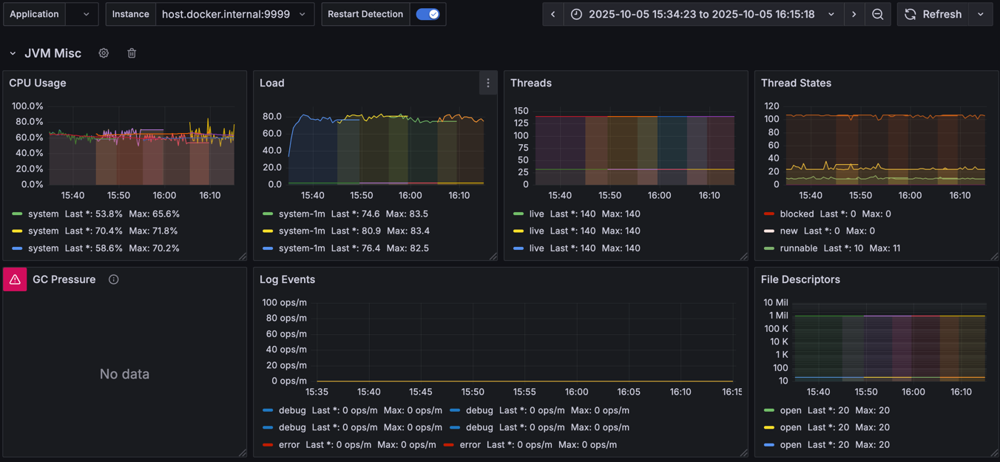

# queues-performance

## Start prometheus
```shell
docker compose -f metrics.yaml up -d
```

Will start prometheus at [localhost:9090](localhost:9090) and grafana at [localhost:3000](localhost:3000) (admin/admin)
with pre configured [dashboards](http://localhost:3000/dashboards)

## Build application
```shell
gradle clean build
```

## Start application
```shell
java -XX:+UseNUMA -XX:+UseG1GC -Xms4G -Xmx4G -jar ./build/libs/queues-performance.jar
```

or use docker:
```shell
docker compose -f app.yaml up
```

or setup everything app, prometheus and grafana with:
```shell
docker compose up
```

## Run tests
To be able to run tests you have to:
- install python3
- install [prometheus](https://prometheus.io/download/#prometheus)

After that you should be able to run tests using command below:
```shell
python3 run_tests.py
```

It will create test results in `results` directory.

## Loading Historical Test Results into Prometheus

So you’ve got some shiny test results lying around and want to see them in Grafana? Perfect — let’s bring them to life!

Inside this repository, you’ll find a folder `results` with a few example test runs.
These were executed using the current repo configuration — 2 CPUs, 4 GB RAM, running inside Docker, with each scenario lasting 10 minutes.

To load them into Prometheus, follow these steps:

### Normalize the data
Prepare the raw results for TSDB block creation:
```shell
python3 normalize_scenarios.py
```

### Generate TSDB blocks
Turn those normalized files into proper Prometheus blocks:
```shell
python3 load_normalized_data.py
```

### Fire up Prometheus & Grafana
Spin up the metrics stack with a single command:
```shell
docker compose -f metrics.yaml up -d
```

If everything goes according to plan, your test results will appear in Grafana dashboards.

The example data currently bundled in this repo covers the following time range:
- 2025-10-05 15:15:00
- 2025-10-05 17:15:00

**Timezone:** CEST (UTC +02:00)

### A Sneak Peek: What You’ll See in Grafana





